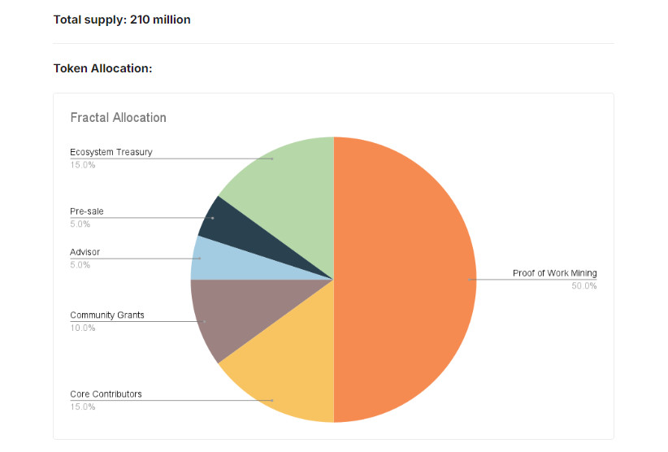
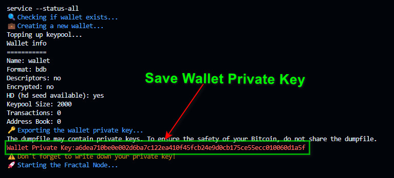
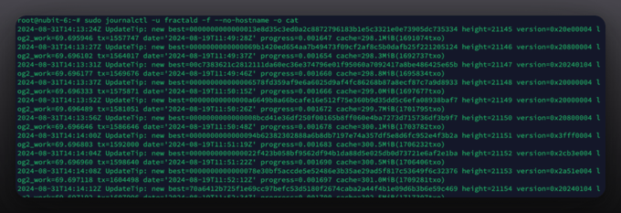

# Fractal BitCoin Node installations Guide

<p align="center">

</p>


## System Requirements

|                |       Minimum            |       Recommended            |
|----------------|--------------------------|------------------------------|
| **RAM**        | 4 GB RAM                 | 8 GB+ RAM                   |
| **CPU Cores**  | 2 CPU cores              | 4+ CPU cores                 |
| **Disk Space** | 100 GB free disk space    | 200 GB+ free disk space (SSD) |
| **Operating System** | Ubuntu 22.04       | Ubuntu 22.04                 |

## 1. Run Node installations By 1 Command

```bash
wget -q https://raw.githubusercontent.com/BidyutRoy2/Fractal-Bitcion/main/fractald_installer.sh && chmod +x fractald_installer.sh && ./fractald_installer.sh
```

## 2. Save Your Node Private Key in NotePad

<p align="center">

</p>

### 3. Checking the Logs Once the installation is complete, you can monitor the node's logs at any time:

```bash
sudo journalctl -u fractald -f --no-hostname -o cat
```

<p align="center">

</p>

This command will show you live logs, helping you keep an eye on your node's performance and status.

# ▄︻デ𝙂𝙚𝙩 𝙇𝙖𝙩𝙚𝙨𝙩 𝘼𝙞𝙧𝙙𝙧𝙤𝙥𝙨 & 𝙐𝙥𝙙𝙖𝙩𝙚𝙨═━一

### ▄︻デ𝙅𝙤𝙞𝙣 𝙏𝙚𝙡𝙚𝙜𝙧𝙖𝙢═━一 [🎀  𝐻𝒾𝒹𝒹𝑒𝓃 𝒢𝑒𝓂  🎀](https://t.me/hiddengemnews) 

### ░▒▓█►─═  𝓗𝓲𝒹ᗪ𝓔η Ǥέ𝕄 ═─◄█▓▒░

